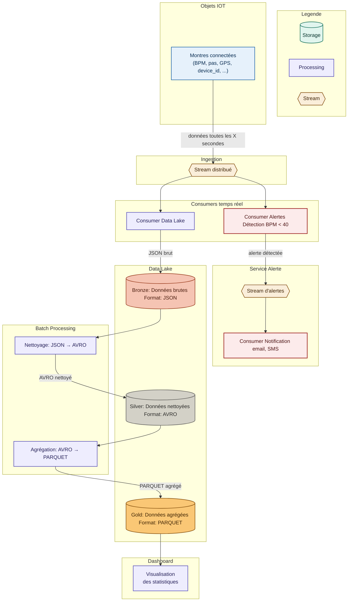

# ClockData
_"Data to save lives"_

## Membres
- Mehdi AZOUZ
- Hani BOUZIDA
- Ryad GAZENAY
- Enzo FRANCIL

## Sujet 
ClockData est une entreprise qui fabrique des montres lifestyle pour le bien être de ses clients. Etant une entreprise soucieuse de la santé de ses clients, elle décide de rajouter un nouveau service d'analyse des statistiques de santé qui sera affiché via un dashboard où les clients pourront voir leurs statistiques de BPM, pas par jour et d'autres informations utiles pour leurs bien être. Ainsi qu'un service d'alerte d'urgence qui peut alerter un proche et soi-même pour prévenir d'un arrêt cardiaque à venir via un système de notification.

## Questions préliminaires

### 1.a Contraintes du stockage pour les statistiques
- Stocker un grand volume de données (200Go/jour, millions de devices)
- Pouvoir scaler horizontalement quand le nombre de montres augmente
- Supporter des lectures analytiques rapides (agrégations, moyennes, historiques)
- Ne pas perdre de données
- Stocker les données sur le long terme

### 1.b Composants nécessaires
Il faut un stockage distribué de type data lake car il répond à l'ensemble des critères listés ci-dessus : scalabilité horizontale, stockage long terme et coût efficace pour de grands volumes.

### 2.a Contrainte pour le service Alerte
La contrainte principale est la latence, si quelqu'un fait un arrêt cardiaque, l'alerte doit partir en quelques secondes maximum. On ne peut pas se permettre d'attendre qu'un batch processing tourne ce qui pourrait avoir des conséquences graves pour l'utilisateur.

### 2.b Composant à choisir
Un stream distribué avec un consumer dédié aux alertes. Le stream permet de traiter chaque message dès qu'il arrive, sans attendre. Le consumer évalue immédiatement si le BPM est critique et déclenche la notification.

# Architecture

