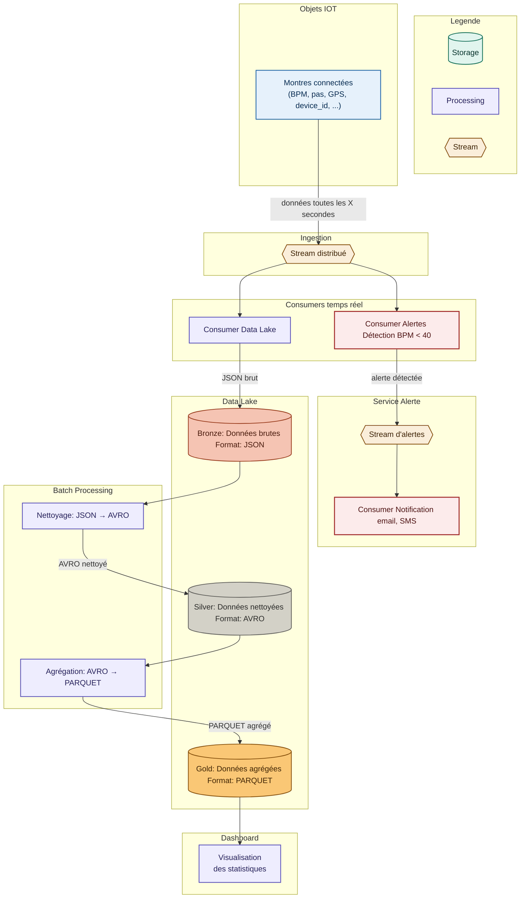

# ClockData
_"Data to save lives"_

## Membres
- Mehdi AZOUZ
- Hani BOUZIDA
- Ryad GAZENAY
- Enzo FRANCIL

## Sujet 
ClockData est une entreprise qui fabrique des montres lifestyle pour le bien être de ses clients. Etant une entreprise soucieuse de la santé de ses clients, elle décide de rajouter un nouveau service d'analyse des statistiques de santé qui sera affiché via un dashboard où les clients pourront voir leurs statistiques de BPM, pas par jour et d'autres informations utiles pour leurs bien être. Ainsi qu'un service d'alerte d'urgence qui peut alerter un proche et soi-même pour prévenir d'un arrêt cardiaque à venir via un système de notification.

## Version cloud AWS

Une version cloud-native du pipeline (Kinesis, Lambda, S3 Bronze/Silver/Gold, Glue, Athena,
CloudWatch), entièrement en Terraform, est disponible dans [`aws/`](aws/README.md). La version
locale ci-dessous reste inchangée.

## Questions préliminaires

### 1.a Contraintes du stockage pour les statistiques
- Stocker un grand volume de données (200Go/jour, millions de devices)
- Pouvoir scaler horizontalement quand le nombre de montres augmente
- Supporter des lectures analytiques rapides (agrégations, moyennes, historiques)
- Ne pas perdre de données
- Stocker les données sur le long terme

### 1.b Composants nécessaires
Il faut un stockage distribué de type data lake car il répond à l'ensemble des critères listés ci-dessus : scalabilité horizontale, stockage long terme et coût efficace pour de grands volumes.

### 2.a Contrainte pour le service Alerte
La contrainte principale est la latence, si quelqu'un fait un arrêt cardiaque, l'alerte doit partir en quelques secondes maximum. On ne peut pas se permettre d'attendre qu'un batch processing tourne ce qui pourrait avoir des conséquences graves pour l'utilisateur.

### 2.b Composant à choisir
Un stream distribué avec un consumer dédié aux alertes. Le stream permet de traiter chaque message dès qu'il arrive, sans attendre. Le consumer évalue immédiatement si le BPM est critique et déclenche la notification.

# Architecture



# Lancer le projet en local (démo)

Toutes les commandes ci-dessous ont été testées de bout en bout (Kafka natif → simulateur →
alertes → data lake → analyse → dashboard). **Pas de Docker** : tout tourne en process natifs
(JVM + Python), conformément à la consigne du prof.

## Prérequis

- Java 17+ (testé avec Java 21)
- [sbt](https://www.scala-sbt.org/) installé
- Python 3.10+ (uniquement pour le dashboard, optionnel)
- Aucun accès réseau requis pendant la démo, hormis pour l'envoi d'email d'alerte (SMTP)

## 0. Broker Kafka (à faire une seule fois)

Le projet n'utilise pas Docker : Kafka tourne en process natif, en mode **KRaft** (pas besoin de
Zookeeper depuis Kafka 3.x).

**Installation (une seule fois)** :

```bash
# Télécharger et extraire Kafka (hors du repo git, ex: dans le home)
curl -fSL -o /tmp/kafka.tgz https://archive.apache.org/dist/kafka/3.7.0/kafka_2.13-3.7.0.tgz
mkdir -p ~/kafka
tar -xzf /tmp/kafka.tgz -C ~/kafka --strip-components=1
rm /tmp/kafka.tgz

# Formater le stockage KRaft avec un UUID de cluster
# (rm -rf par sécurité : évite "Invalid cluster.id" si le dossier existe déjà
# d'un essai précédent)
cd ~/kafka
rm -rf /tmp/kraft-combined-logs
KAFKA_CLUSTER_ID=$(bin/kafka-storage.sh random-uuid)
bin/kafka-storage.sh format -t "$KAFKA_CLUSTER_ID" -c config/kraft/server.properties
```

> Si tu relances cette étape de formatage une deuxième fois (par exemple après une première
> tentative), et que tu obtiens `Invalid cluster.id in: /tmp/kraft-combined-logs/meta.properties`,
> c'est parce que ce dossier contient déjà les métadonnées d'un ancien formatage. Le
> `rm -rf /tmp/kraft-combined-logs` ci-dessus règle le problème (déjà inclus dans la commande).

**Démarrer Kafka** (à chaque session de démo, dans un terminal dédié) :

```bash
cd ~/kafka
bin/kafka-server-start.sh config/kraft/server.properties
```

Le broker écoute sur `localhost:9092`. Laisser ce terminal ouvert pendant toute la démo.

**Vérifier que Kafka répond** (optionnel) :

```bash
cd ~/kafka
bin/kafka-topics.sh --create --topic smoketest --bootstrap-server localhost:9092
echo "hello" | bin/kafka-console-producer.sh --topic smoketest --bootstrap-server localhost:9092
bin/kafka-console-consumer.sh --topic smoketest --from-beginning --bootstrap-server localhost:9092 --timeout-ms 5000
bin/kafka-topics.sh --delete --topic smoketest --bootstrap-server localhost:9092
```

**Arrêter Kafka** (fin de démo) : `Ctrl+C` dans son terminal, ou `pkill -f kafka.Kafka`.

## 1. Composant 1 — Simulateur (`simulator/`)

```bash
cd simulator
sbt "runMain Simulator"
```

Variables d'environnement optionnelles :

| Variable | Défaut | Rôle |
|---|---|---|
| `KAFKA_BOOTSTRAP` | `localhost:9092` | Adresse du broker |
| `SIM_DEVICES` | `3` | Nombre de montres simulées |
| `SIM_INTERVAL_MS` | `2000` | Intervalle entre deux envois (ms) |
| `SIM_ANOMALY_RATE` | `0.02` | Probabilité d'un BPM critique < 40 (pour tester les alertes) |

Exemple pour forcer des alertes fréquentes en démo :

```bash
SIM_ANOMALY_RATE=0.25 SIM_INTERVAL_MS=1000 sbt "runMain Simulator"
```

## 2. Composants 2 & 3 — Alertes (`alert-service/`)

Dans deux terminaux séparés :

```bash
cd alert-service
sbt "runMain ConsumerAlert"     # détecte BPM < 40, republie dans le topic "alerts"
```

```bash
cd alert-service
cp .env.example .env   # ajuster SMTP_USER, SMTP_PASSWORD (App Password Gmail), ALERT_RECIPIENT
export $(grep -v '^#' .env | xargs)
sbt "runMain ConsumerNotif"     # lit "alerts", envoie l'email
```

Sans configuration SMTP valide, `ConsumerNotif` plantera au démarrage (les variables
`SMTP_USER`/`SMTP_PASSWORD`/`ALERT_RECIPIENT` sont obligatoires) : pour une démo sans envoi
d'email réel, il suffit de ne pas lancer `ConsumerNotif` — `ConsumerAlert` affiche déjà les
alertes détectées en console.

## 3. Composant 4 — Data Lake (`datalake-service/`)

```bash
cd datalake-service

# Ingestion Kafka -> Bronze (streaming, laisser tourner le temps de générer des données
# puis Ctrl+C)
sbt "runMain ConsumerDataLake"

# Nettoyage Bronze -> Silver (batch)
sbt "runMain ProcessingBronzeSilver"

# Agrégation Silver -> Gold (batch)
sbt "runMain ProcessingSilverGold"
```

## 4. Composant 5 — Analyse (`analysis-service/`)

```bash
cd analysis-service
sbt "runMain Analysis"
```

Affiche en console les réponses à 4 questions (alertes semaine/week-end, appareil le plus
critique, heure de pic d'activité, appareil le plus actif), et les sauvegarde dans
`data/gold/analysis/`.

## 5. Dashboard (optionnel, Python)

```bash
cd dashboard
pip install -r requirements.txt
streamlit run app.py
```

Ouvrir <http://localhost:8501>. Sans données Gold, générer un jeu d'exemple avec
`python3 generate_sample_data.py`.

## Vérifier que tout fonctionne

```bash
ls data/bronze/*.json      # messages bruts ingérés
ls data/silver/*.avro      # données nettoyées
ls data/gold/*.parquet     # agrégats horaires/journaliers
cat data/gold/analysis/*.json   # réponses aux 4 questions
```

## Tout arrêter

`Ctrl+C` dans chaque terminal (simulateur, ConsumerAlert, ConsumerNotif, ConsumerDataLake,
dashboard), puis arrêter Kafka (`Ctrl+C` dans son terminal ou `pkill -f kafka.Kafka`).
