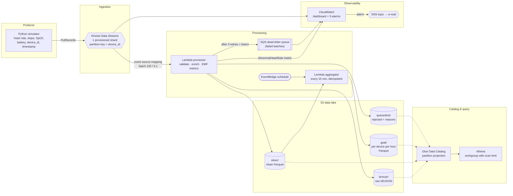

[](https://github.com/ryadg-kura/clockdata/actions/workflows/aws-terraform.yml)

# ClockData on AWS: cloud-native version

_"Data to save lives"_, now serverless on AWS.

This folder is the AWS version of the [local ClockData pipeline](../README.md) (Kafka + Spark +
Scala). The local version is unchanged. Everything here is self-contained in `aws/`.

> [!WARNING]
> **This stack costs money while it exists, even if you send no data.** The Kinesis shard is
> billed every hour (about **$0.43/day, $13/month** in Paris). **Run `make destroy` after every
> demo.** See [Cost](#cost-read-this-first).

---

## Contents

- [Architecture](#architecture)
- [Why each AWS service](#why-each-aws-service)
- [Design trade-offs](#design-trade-offs)
- [Cost (read this first)](#cost-read-this-first)
- [Setting up AWS credentials (first time on AWS)](#setting-up-aws-credentials-first-time-on-aws)
- [Run the demo](#run-the-demo)
- [Sample Athena queries](#sample-athena-queries)
- [Monitoring and alerting](#monitoring-and-alerting)
- [Testing without AWS](#testing-without-aws)
- [CI (GitHub Actions)](#ci-github-actions)
- [Repository layout](#repository-layout)
- [Screenshots](#screenshots)
- [Credits](#credits)

---

## Architecture



**Flow of one event**

1. The simulator sends `{"event_id", "device_id", "timestamp", "heart_rate", "steps", "spo2", "battery"}`
   to Kinesis, keyed by `device_id`, so each watch's events stay in order.
2. The Kinesis event source mapping invokes the **processor** Lambda with up to 100 records,
   or after at most 5 seconds.
3. The processor writes:
   - **Bronze**: every record exactly as received (payload plus Kinesis metadata), partitioned by
     *arrival* hour. It is the replayable source of truth.
   - **Silver**: records that pass validation (types, ranges, timestamp sanity), enriched with
     `heart_rate_zone`, `is_abnormal_hr`, `spo2_status`, `battery_low` and end-to-end latency.
     Stored as Snappy Parquet, partitioned by *event* hour (`dt=YYYY-MM-DD/hour=HH`).
   - **Quarantine**: rejected records with the list of reasons.
   - One CloudWatch **EMF** log line with `ValidEvents`, `InvalidEvents`, `AbnormalHeartRate` and
     `EndToEndLatency`. This creates metrics without a `PutMetricData` call or extra permission.
4. Every 15 minutes, the **aggregator** reads the Silver files for the current and previous hour,
   de-duplicates on `event_id` (Kinesis is at-least-once), and overwrites one Gold Parquet file
   per hour with per-device metrics.
5. **Athena** queries every layer through the **Glue Data Catalog**. Partition projection means
   no crawler is needed.

### Local version vs AWS version

| Concern | Local version | AWS version |
|---|---|---|
| Producer | Scala / Python simulator → Kafka | Python simulator → Kinesis (`boto3.put_records`) |
| Stream | Kafka (KRaft, 1 broker) | Kinesis Data Streams, 1 shard |
| Stream processing | Scala consumers | Lambda (Python 3.13, arm64) |
| Bronze / Silver / Gold | local disk, JSON → Avro → Parquet (Spark batch) | S3, JSON → Parquet → Parquet (Lambda + pyarrow) |
| Query | Spark `analysis-service` | Glue Data Catalog + Athena (SQL) |
| Alerting | Kafka `alerts` topic → e-mail (SMTP) | CloudWatch alarm → SNS → e-mail |
| Failure handling | — | retries, bisect, SQS DLQ, quarantine prefix |
| Monitoring | console logs | CloudWatch dashboard |
| Infrastructure | manual install | Terraform, `make deploy` / `make destroy` |

---

## Why each AWS service

| Service | Role | Why this one |
|---|---|---|
| **Kinesis Data Streams** | ingestion | The closest managed equivalent of the local Kafka topic: per-key ordering, replay during retention, several consumers, and native Lambda integration with retries, bisect and DLQ. One provisioned shard (1 MB/s, 1,000 records/s in) is far more than the demo needs. |
| **Lambda** | stream processing and aggregation | Pay per millisecond and covered by the always-free tier (1M requests and 400,000 GB-s/month). No cluster to start or forget. Arm64 (Graviton) is about 20% cheaper than x86. |
| **AWS SDK for pandas layer** | pyarrow in Lambda | AWS-managed public layer with pyarrow. Parquet is written without building or uploading a 100+ MB package. |
| **S3** | data lake | Durable, cheap, and the native storage of Athena and Glue. Lifecycle rules delete demo data after 30 days. |
| **Glue Data Catalog** | table metadata | Free for the first million objects. Athena reads its tables, and partition projection removes the need for crawlers ($0.44/DPU-hour). |
| **Athena** | SQL on the lake | Serverless, $5 per TB scanned. Parquet plus partition filters keep demo queries at the 10 MB minimum, about $0.00005 each. The workgroup rejects any query scanning more than 1 GB. |
| **CloudWatch** (metrics, alarms, dashboard, logs) | monitoring and alerting | Built in. The free tier covers 10 custom metrics, 10 alarms and 3 dashboards; this stack uses 4, 5 and 1. |
| **SQS** | dead-letter queue | Keeps the shard/sequence range of any batch that failed every retry, so it can be replayed from Kinesis. 1M requests/month free. |
| **SNS** | alarm notifications | E-mail fan-out for alarms. 1,000 e-mails/month free. |
| **EventBridge** | aggregation schedule | Scheduled rules are free. |
| **Terraform** | IaC | One command creates or deletes all 46 resources, and destroy is complete and repeatable. |

---

## Design trade-offs

### Kinesis vs SQS vs MSK (ingestion)

| | **Kinesis Data Streams** ✅ | SQS | MSK (managed Kafka) |
|---|---|---|---|
| Ordering per device | ✅ per partition key | ❌ standard queue / ⚠️ FIFO per message group, lower throughput | ✅ per partition |
| Replay | ✅ 24 h (up to 365 days, extra cost) | ❌ a message is gone once consumed | ✅ |
| Several independent consumers | ✅ (shared or enhanced fan-out) | ❌ one consumer per queue (needs SNS fan-out) | ✅ consumer groups |
| Reuse of the local Kafka code | ❌ new client | ❌ | ✅ nearly unchanged |
| Ops | none (choose a shard count) | none | VPC, brokers, storage, versions |
| **Idle cost** | **~$0.018/h** (1 shard, Paris) | **$0**, pay per request, 1M free | Provisioned: 2+ brokers running 24/7 · Serverless: ~$0.75 per cluster-hour, **several $/day** |

**Choice:** Kinesis keeps the streaming semantics of the local Kafka design (ordered, replayable,
multi-consumer) for about 2 cents an hour. SQS would be free, but it is a queue, not a log: you
can't replay history into a new consumer. MSK is the "lift and shift" option for the Scala
consumers, but it costs far too much for a personal account. Kinesis *on-demand* mode was
rejected too: it has a higher per-stream hourly fee than one provisioned shard at this tiny,
steady volume.

### Lambda vs Glue streaming (processing)

| | **Lambda** ✅ | Glue streaming ETL (Spark) |
|---|---|---|
| Idle / minimum cost | $0 (free tier) | 2 DPU minimum × $0.44/DPU-h ≈ **$0.88/h** while running |
| Start-up | milliseconds (cold start ~1 s with pyarrow) | minutes |
| Latency | seconds (5 s batching window) | micro-batch window (≥ seconds) + Spark overhead |
| Stateful windows / joins | ❌ none, so Gold runs as a scheduled micro-batch | ✅ Spark Structured Streaming |
| Reuse of the local Spark jobs | ❌ rewritten in Python | ✅ close to the local `datalake-service` |
| Failure handling | retries, bisect, DLQ built into the event source mapping | checkpoints |

**Choice:** at a few events per second, Lambda costs nothing and responds within seconds. It
lacks streaming state, so hourly aggregates come from a separate **idempotent** job: the
aggregator overwrites one fixed file per hour, so re-running it is always safe. At thousands of
events per second, or with windowed joins, Glue streaming or Managed Service for Apache Flink
would become the better tool.

### Other decisions

- **Gold via Lambda + pyarrow instead of Athena `INSERT INTO` / CTAS.** An `INSERT` appends, so
  re-running it would duplicate rows. Overwriting a deterministic key is idempotent, and the
  logic is unit-tested locally.
- **At-least-once delivery.** Kinesis and Lambda can redeliver a batch. Bronze and Silver object
  keys come from the batch's sequence-number range, so an identical retry overwrites the same
  files. A bisected retry can still produce a duplicate, which Gold removes on `event_id`.
- **Bronze partitioned by arrival time, Silver/Gold by event time.** Bronze must accept
  anything, including records without a usable timestamp. Analytics need event time.
- **Validation errors are data, not exceptions.** A malformed record goes to `quarantine/`
  and never blocks the shard. Only infrastructure failures (such as S3 being unavailable) raise,
  which triggers retry → bisect → DLQ.
- **Partition projection instead of a Glue crawler.** New hours are queryable immediately, at
  no cost.
- **Alerting through a CloudWatch metric alarm.** Detection takes about 1 minute, which is fine
  for a monitoring demo. A real "cardiac alert" product would publish to SNS directly from the
  processor, in seconds, as the local `alert-service` does.
- **One shared schema file per table** (`lambdas/*/schema_*.json`). Terraform reads it to define
  the Glue columns, and the Lambda reads it to build the Arrow schema, so they cannot drift apart.
- **No reserved concurrency.** New AWS accounts often have a concurrency quota of 10, and
  reserving any of it makes the deployment fail.

---

## Cost (read this first)

Prices are the official on-demand prices for **eu-west-3 (Paris)**, the default region,
retrieved from the AWS Price List API in September 2026.

### The only thing billed per hour: the Kinesis shard

| Region | Price per shard-hour | Per day | Per month (730 h) |
|---|---|---|---|
| **eu-west-3 (Paris), default** | **$0.0179** | **$0.43** | **$13.07** |
| eu-west-1 (Ireland) | $0.0170 | $0.41 | $12.41 |
| us-east-1 (N. Virginia) | $0.0150 | $0.36 | $10.95 |

Plus $0.0173 per million PUT payload units (25 KB each). The default simulator sends 18,000
events per hour, which comes to about $0.0003/hour.

### A typical 1-hour demo

| Item | Estimate |
|---|---|
| Kinesis shard (1 h) | $0.018 |
| Kinesis PUT payload units (5 watches × 1 event/s) | $0.0003 |
| S3 PUT requests (~2,000 × $0.0053/1,000) | ~$0.01 |
| S3 storage (a few MB) | < $0.001 |
| Lambda (~800 invocations) | $0, always-free tier |
| Athena (6 queries at the 10 MB minimum) | ~$0.0003 |
| CloudWatch (4 custom metrics, 5 alarms, 1 dashboard, logs) | $0 within the free tier |
| SQS, SNS, Glue Data Catalog, EventBridge | $0 |
| **Total** | **about $0.03** |

**If you forget to destroy:** about $13/month for the shard alone, plus about $0.30 per custom
metric per month once the free tier is used up.

### Cost safety built into the stack

- `make destroy` deletes **every** resource. The S3 buckets use `force_destroy`, so they are
  emptied and deleted. Log groups are managed by Terraform. Afterwards `make leftovers` checks
  that nothing tagged `Project=clockdata` remains.
- S3 lifecycle rules delete lake data after 30 days and Athena results after 7 days.
- The Athena workgroup rejects queries scanning more than 1 GB (at most $0.005 per query).
- Kinesis retention is 24 h (the included minimum). Shard-level metrics are off.
- Log retention is 7 days.

> **About the free tier:** AWS changed its free tier in July 2025. Accounts created since then get
> sign-up credits and a 6-month free plan instead of the old 12-month free tier. Lambda, SQS,
> SNS and the CloudWatch basics stay free within their monthly limits. **Kinesis Data Streams is
> never free.** Check *Billing and Cost Management → Free tier* and *Credits* for your account.

---

## Setting up AWS credentials (first time on AWS)

You only do this once. It avoids the two classic beginner mistakes: using the root account day
to day, and leaving long-lived access keys on disk.

### 1. Create and secure the account

1. Sign up at <https://aws.amazon.com/>. You will need a credit card.
2. Sign in as **root** (the account e-mail), open *IAM → Dashboard*, and **enable MFA on the root
   user**. After this step, use root only for billing and account settings.

### 2. Set a budget alarm before creating anything

1. Open *Billing and Cost Management → Budgets → Create budget*.
2. Choose the **Zero spend budget** template, or a *Monthly cost budget* of $5, and enter your
   e-mail.
3. AWS now e-mails you as soon as anything costs money. This is your safety net if you ever
   forget `make destroy`.

### 3. Create a day-to-day user with IAM Identity Center (recommended)

Identity Center gives you **temporary** credentials that expire on their own, so no secret key is
stored on your laptop.

1. Open *IAM Identity Center* in the region you will use (e.g. **Europe (Paris) eu-west-3**)
   and click **Enable**.
2. Go to *Users → Add user*, enter your name and e-mail, and accept the invitation e-mail to set
   a password and MFA.
3. Go to *Permission sets → Create permission set → Predefined → `AdministratorAccess`*.
   Terraform needs to create IAM roles, which `PowerUserAccess` cannot do. On a personal sandbox
   account, AdministratorAccess on your own user is the pragmatic choice.
4. Go to *AWS accounts*, select your account, then *Assign users or groups*, and choose your user
   and the permission set.
5. Copy the **AWS access portal URL** shown on the Identity Center dashboard
   (`https://d-xxxxxxxxxx.awsapps.com/start`).

### 4. Install the tools

| Tool | Install | Check |
|---|---|---|
| AWS CLI v2 | <https://docs.aws.amazon.com/cli/latest/userguide/getting-started-install.html> | `aws --version` |
| Terraform ≥ 1.6 | <https://developer.hashicorp.com/terraform/install> | `terraform version` |
| Python ≥ 3.11 + `make` | your OS package manager | `python3 --version` |

### 5. Configure a CLI profile and log in

```bash
aws configure sso
#   SSO session name:          clockdata
#   SSO start URL:             https://d-xxxxxxxxxx.awsapps.com/start   (from step 3.5)
#   SSO region:                eu-west-3
#   SSO registration scopes:   (press Enter)
#   -> a browser opens, approve the request
#   CLI default client Region: eu-west-3
#   CLI default output format: json
#   Profile name:              clockdata

export AWS_PROFILE=clockdata     # add it to ~/.bashrc / ~/.zshrc if you like
aws sts get-caller-identity      # prints your account id and role: you are ready
```

When the session expires, run `aws sso login` again. Terraform, the AWS
CLI and the Python scripts all read `AWS_PROFILE`, and **no credential is ever written in this
repository**.

<details>
<summary>Alternative: IAM user with access keys (simpler, less safe)</summary>

1. *IAM → Users → Create user* (no console access), then attach `AdministratorAccess`.
2. *Security credentials → Create access key → Command Line Interface*.
3. `aws configure --profile clockdata` and paste the key ID and secret.
4. `export AWS_PROFILE=clockdata`

The keys stay valid until you delete them and live in plain text in `~/.aws/credentials`.
Never commit them, and **delete the access key in the IAM console when you are done**.
</details>

---

## Run the demo

All commands run from the `aws/` folder.

```bash
cd aws
make                      # list every target

make test                 # optional: run the local test suite, no AWS needed
make deploy               # shows the plan, type "yes" -> about 2 minutes. BILLING STARTS NOW
make simulate             # 5 watches, 1 event/s each, for 5 minutes
make aggregate            # build Gold now instead of waiting up to 15 minutes
make query                # run the 6 sample Athena queries
make urls                 # CloudWatch dashboard + Athena console links

make destroy              # type "yes": deletes everything, then checks for leftovers
```

> [!IMPORTANT]
> **Always finish with `make destroy`**, even if something failed halfway. Terraform tracks
> what was created in `infra/terraform.tfstate`, so destroy cleans up partial deployments too.
> Don't delete that file while the stack exists.

Useful knobs:

```bash
make simulate DEVICES=20 INTERVAL=0.5 DURATION=600   # more traffic
make simulate ANOMALY_RATE=0.2                        # trigger the heart-rate alarm quickly
make simulate INVALID_RATE=0.1                        # fill the quarantine
make query Q=queries/03_abnormal_heart_rate.sql       # a single query
make aggregate HOURS=24                               # backfill Gold for the last 24 h
make dlq                                              # look at failed batches, if any
```

To receive alarm e-mails, create `infra/terraform.tfvars` (git-ignored) from
`infra/terraform.tfvars.example` with `alert_email = "you@example.com"`, run `make deploy`, and
click the confirmation link AWS sends you.

---

## Sample Athena queries

Each query is in [`queries/`](queries/). `make query` runs them all, and Terraform also installs
them as **saved queries** in the Athena console (workgroup `clockdata-dev-workgroup`, database
`clockdata_dev_lake`). All times are UTC.

**Latest events (Silver)**

```sql
SELECT event_time, device_id, heart_rate, heart_rate_zone, steps, spo2, spo2_status, battery,
       end_to_end_latency_ms
FROM silver_events
WHERE dt = date_format(current_date, '%Y-%m-%d')
ORDER BY event_time DESC
LIMIT 20;
```

**Abnormal heart-rate events in the last 24 hours**

```sql
SELECT event_time, device_id, heart_rate, heart_rate_zone, spo2, spo2_status
FROM silver_events
WHERE dt >= date_format(current_date - INTERVAL '1' DAY, '%Y-%m-%d')
  AND is_abnormal_hr
ORDER BY event_time DESC
LIMIT 50;
```

**Today's leaderboard (Gold)**

```sql
SELECT device_id,
       sum(total_steps)                                               AS steps_today,
       round(sum(avg_heart_rate * event_count) / sum(event_count), 1) AS avg_heart_rate,
       max(max_heart_rate)                                            AS peak_heart_rate,
       sum(abnormal_hr_count)                                         AS abnormal_events,
       min(min_spo2)                                                  AS lowest_spo2
FROM gold_device_hourly
WHERE dt = date_format(current_date, '%Y-%m-%d')
GROUP BY device_id
ORDER BY steps_today DESC;
```

**Data quality: received vs rejected, and why (Bronze + Quarantine)**: see
[`05_data_quality.sql`](queries/05_data_quality.sql).

Other queries: hourly metrics per device (`02`) and watches with low battery or low SpO2 right
now (`06`).

> Always filter on `dt` (and `hour` where possible). Athena then reads only those S3 prefixes,
> which keeps the scan, and the bill, tiny.

---

## Monitoring and alerting

The **CloudWatch dashboard** `clockdata-dev` (link from `make urls`) shows:

- **Throughput**: Kinesis incoming records vs records read by Lambda
- **Events**: valid / rejected / abnormal heart rate per minute
- **Latency**: event → processed p50/p99, and the Lambda iterator age
- **Lambda health**: invocations, errors, throttles, duration
- **DLQ depth** and the state of every alarm

| Alarm | Fires when |
|---|---|
| `clockdata-dev-abnormal-heart-rate` | ≥ 1 event with heart rate < 40 or > 180 BPM in a minute (thresholds are Terraform variables) |
| `clockdata-dev-processor-errors` | the processor Lambda throws |
| `clockdata-dev-processor-lagging` | the processor is more than 60 s behind the stream for 3 minutes |
| `clockdata-dev-dlq-not-empty` | a batch landed in the dead-letter queue |
| `clockdata-dev-aggregator-errors` | the Gold aggregation fails |

To see *which* watch triggered the heart-rate alarm, open CloudWatch Logs Insights on
`/aws/lambda/clockdata-dev-processor` and run:

```
fields @timestamp, device_id, heart_rate, zone
| filter type = "ABNORMAL_HEART_RATE"
| sort @timestamp desc
```

---

## Testing without AWS

Nothing in the test suite talks to AWS. `moto` provides in-memory Kinesis and S3, and
credentials are dummies.

```bash
make test          # 58 tests: validation, enrichment, Parquet schema, idempotency,
                   # simulator realism, end-to-end simulator -> Kinesis -> Lambda -> Gold,
                   # and every Athena query run on real pipeline output (via DuckDB)
make validate      # terraform fmt -check + validate
make plan-offline  # full terraform plan with dummy credentials: 46 resources, no AWS account
make simulate-dry  # print simulated events to stdout
```

The Athena queries are transpiled from Trino SQL to DuckDB with `sqlglot` and executed on the
Parquet/NDJSON files the Lambdas produce, using the same `dt=/hour=` layout as S3.

---

## CI (GitHub Actions)

[`.github/workflows/aws-terraform.yml`](../.github/workflows/aws-terraform.yml) runs:

1. **On every push and pull request:** `make test` on Python 3.13 (the Lambda runtime). These
   are the moto-based tests, so no AWS account is needed.
2. **On pull requests:** `terraform fmt -check` and `terraform validate`, then `terraform plan`:
   - **offline** by default, with dummy credentials and `offline_plan=true`. No AWS account or
     secret is needed.
   - **against your account** if you add a repository secret `AWS_PLAN_ROLE_ARN`: a role with
     `ReadOnlyAccess` that trusts GitHub's OIDC provider (`token.actions.githubusercontent.com`)
     for this repository. CI then gets short-lived credentials and stores no keys.

CI never runs `apply`.

---

## Repository layout

```
aws/
├── Makefile                 deploy / simulate / aggregate / query / destroy / test ...
├── simulator/simulator.py   realistic smartwatch fleet -> Kinesis (or stdout with --dry-run)
├── lambdas/
│   ├── processor/           Kinesis -> bronze / silver / quarantine + EMF metrics
│   │   ├── handler.py
│   │   └── schema_silver.json   shared by the Lambda and the Glue table
│   └── aggregator/          silver -> gold, per device per hour
│       ├── handler.py
│       └── schema_gold.json
├── queries/*.sql            sample Athena queries (also saved in the Athena console)
├── scripts/query.py         runs queries, prints tables + scanned bytes + cost
├── tests/                   pytest + moto + DuckDB, no AWS needed
└── infra/                   Terraform
    ├── versions.tf providers.tf variables.tf main.tf outputs.tf
    ├── streaming.tf         Kinesis, SQS DLQ, SNS
    ├── storage.tf           S3 buckets (encryption, TLS-only, lifecycle, force_destroy)
    ├── compute.tf           Lambdas, event source mapping, schedule, log groups
    ├── iam.tf               one least-privilege role per Lambda
    ├── catalog.tf           Glue database/tables (partition projection), Athena workgroup
    └── monitoring.tf        alarms + dashboard
```

**IAM, least privilege:**

- The processor can only read *this* stream, `PutObject` under `bronze/`, `silver/` and
  `quarantine/`, send to *this* DLQ, and write to its own log group.
- The aggregator can only list and read `silver/`, write `gold/`, and write to its own log group.
- No wildcard actions, no `*FullAccess` policies, no credentials in code or state.

---

## Screenshots

_Placeholders: capture these during a demo and save them in [`assets/screenshots/`](assets/screenshots/)._

| | |
|---|---|
|  <br/> _TODO: CloudWatch dashboard during `make simulate`_ |  <br/> _TODO: Athena, leaderboard query result_ |
|  <br/> _TODO: S3 bucket with bronze/ silver/ gold/ quarantine/_ |  <br/> _TODO: abnormal heart-rate alarm e-mail_ |

---

## Credits

The original local ClockData pipeline (Kafka, Spark, Scala alert and data lake services,
analysis, dashboard) was designed and built by:

- **Mehdi AZOUZ**
- **Hani BOUZIDA**
- **Ryad GAZENAY**
- **Enzo FRANCIL**

This AWS cloud-native version is a port of their design (medallion data lake, real-time
heart-rate alerting, per-device aggregates) to managed AWS services.
